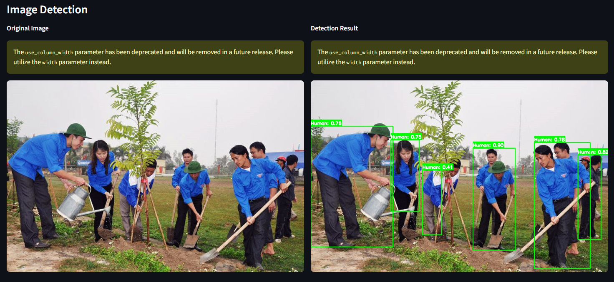

# Human Detector - YOLOv8

Dự án này tập trung vào việc xây dựng và huấn luyện mô hình phát hiện người (Human Detection) sử dụng kiến trúc YOLOv8 từ thư viện Ultralytics, kèm theo giao diện web để demo.

## Kết quả nhận diện (Demo)


## Tính năng chính
- **Huấn luyện mô hình:** Quy trình huấn luyện tự động với YOLOv8s trên tập dữ liệu người.
- **Đánh giá (Validation):** Kiểm tra hiệu năng mô hình với các chỉ số mAP.
- **Dự đoán (Inference):** Hỗ trợ nhận diện người từ hình ảnh local thông qua CLI hoặc giao diện Web.
- **Xuất mô hình:** Chuyển đổi sang định dạng ONNX để triển khai đa nền tảng.
- **Web App Demo:** Giao diện web trực quan với Streamlit giúp trải nghiệm nhận diện dễ dàng.

## Cấu trúc dự án
- `app/app.py`: Streamlit web app chính.
- `app/utils.py`: Các hàm tiện ích xử lý ảnh và detection cho web app.
- `scripts/train.py`: Script huấn luyện mô hình.
- `scripts/predict.py`: CLI tool để chạy dự đoán trên ảnh local.
- `models/`: Thư mục chứa các file trọng số mô hình (`best.pt`, `last.pt`).
- `dataset/`: Cấu hình dữ liệu và file ảnh mẫu.
- `requirements.txt`: Các thư viện phụ thuộc cần cài đặt.

## Cài đặt và sử dụng

### 1. Cài đặt môi trường
Yêu cầu Python 3.8+. Nên sử dụng môi trường ảo (venv hoặc conda).
```bash
pip install -r requirements.txt
```

### 2. Chạy Web App Demo
```bash
streamlit run app/app.py
```
Giao diện sẽ hiển thị tại: `http://localhost:8501`

### 3. Sử dụng công cụ dòng lệnh (CLI)
Để nhận diện một ảnh bất kỳ qua command line:
```bash
python scripts/predict.py --source "đường/dẫn/đến/ảnh.jpg" --output "đường/dẫn/lưu/kết_quả.jpg"
```

## Kết quả huấn luyện
Dựa trên kiến trúc YOLOv8 small:
- **mAP50:** ~0.847
- **mAP50-95:** ~0.598

## Lộ trình phát triển
- [x] Web app cơ bản với Streamlit
- [ ] Video processing
- [ ] Real-time webcam detection
- [ ] People counting
- [ ] Tracking (DeepSORT, ByteTrack)
- [ ] Heatmap visualization
- [ ] Docker deployment
- [ ] API endpoint

---
*Dự án được thực hiện nhằm mục đích nghiên cứu và ứng dụng Computer Vision trong nhận diện đối tượng.*
